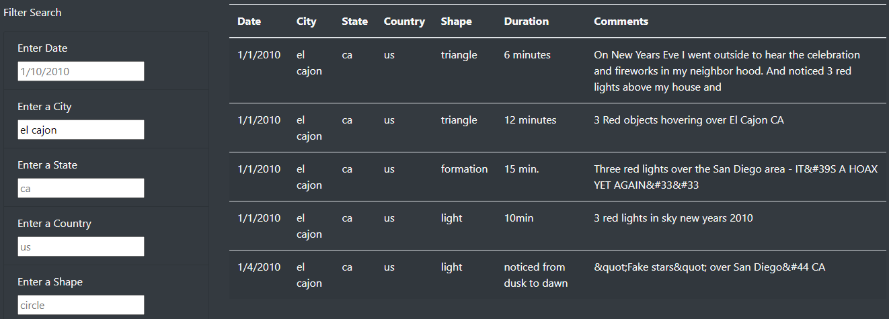
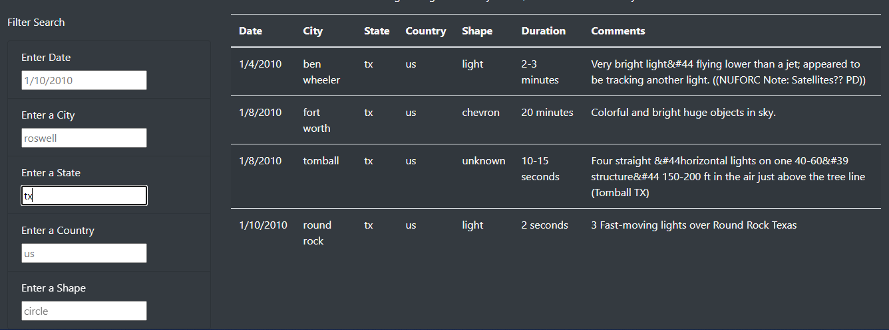
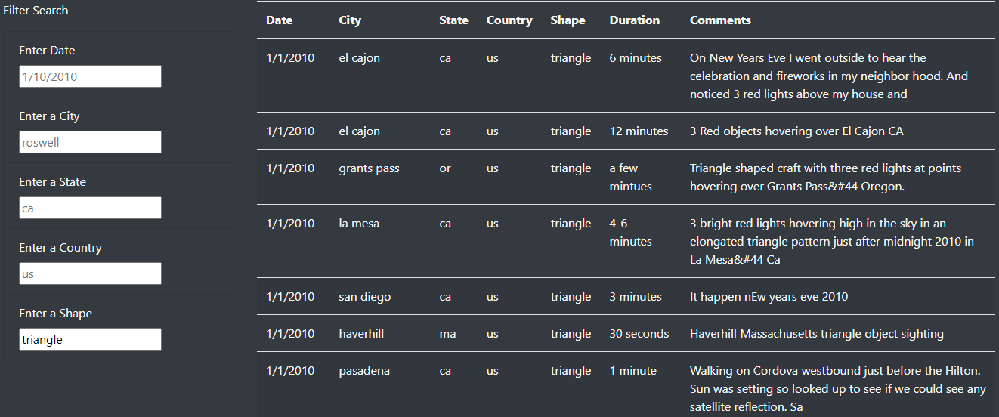
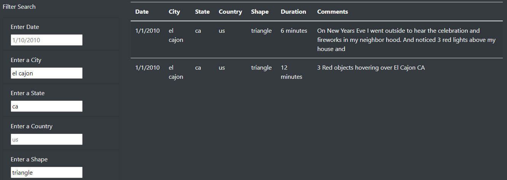

# UFO Analysis
## Overview

Dana asked me to recode her webpage and dynamic table because she’d like to provide a more in-depth analysis of UFO sightings by allowing users to filter for multiple criteria at the same time. In addition to the date, I’ll add table filters for the city, state, country, and shape.

## Results

Originally the user only could filter the table writing the date of the event looking for. After the recoding the user has other four criteria filters to obtain the featured information. For example:
`I` If the user writes “el Cajon” in the city data box, the table will output the following:

`(ii)` If “tx” is written in the state data box, the table will output this:

`(iii)` If the user writes “triangle” in the shape data box, the table will return all the cases where the phenomenon has the form of a triangle. Something like:

`(iii)` Finally, the user can select many filters at the same time to achieve accurate results, for example, by inputting “triangle” in the shape box, plus “ca” in the state box and “el Cajon” in the city box, to pursuant the following:

## Results

**1.** The principal drawback of the design asked by Dana is the searching by Country because is useless due to all the sights registered are from there, so is the only result possible.

**2.** I advise changing the country filter for a duration data box because from a glance of the data would be better to get the minutes of the sight.

**3.** In the Comments section of the table, I noticed appears many times the &#44 which refers to a coma in HTML language, so my advice is to parse and clean the text before outputting on the webpage.

